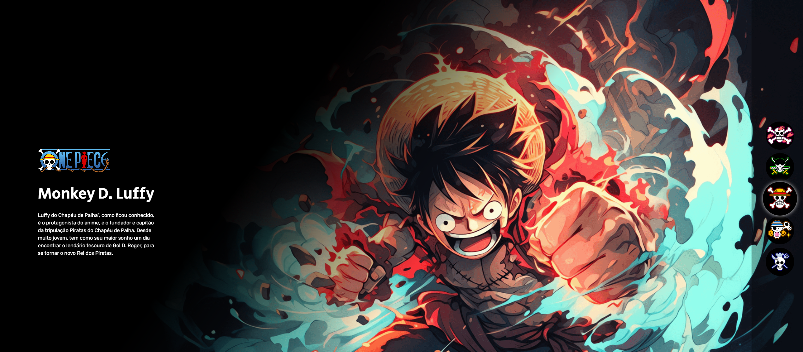
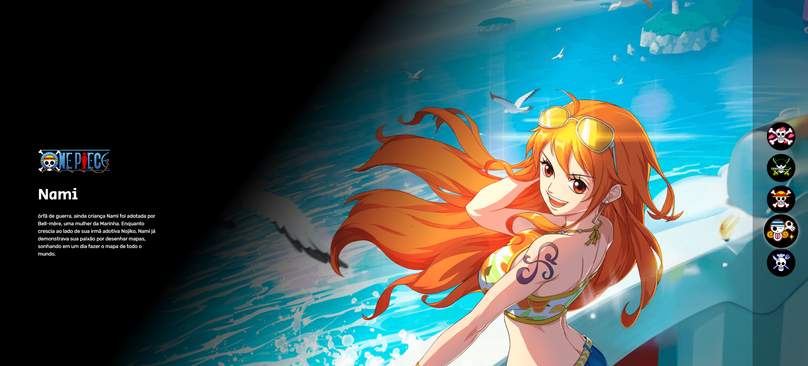

# One Piece

Página de apresentação dos personagens principais de One Piece, em HTML e CSS.

Demo: https://theusan777.github.io/projeto.onepiece/

## Preview

<p align="center">
  
</p>

<p align="center">
  
</p>

## Sobre o projeto

Página com uma seção pra cada personagem (Tony Chopper, Roronoa Zoro, Monkey D. Luffy, Nami e Sanji), com imagem grande de destaque e um texto curto sobre cada um. Do lado direito fica uma navegação com os emblemas da tripulação.

## Tecnologias

- HTML
- CSS

## Funcionalidades

- Seção individual para cada personagem, com imagem e descrição
- Navegação lateral por ícones (emblemas da tripulação)

## Estrutura do projeto

```
index.html
src/
  imagens/
```

## Como executar

git clone https://github.com/theusan777/projeto.onepiece.git

Depois é só abrir o `index.html` no navegador.

## Deploy

[Acessar projeto](https://theusan777.github.io/projeto.onepiece/)

## Aprendizados

Projeto de prática de layout com imagem grande de fundo e texto sobreposto, usando conteúdo de um tema que eu curto.
